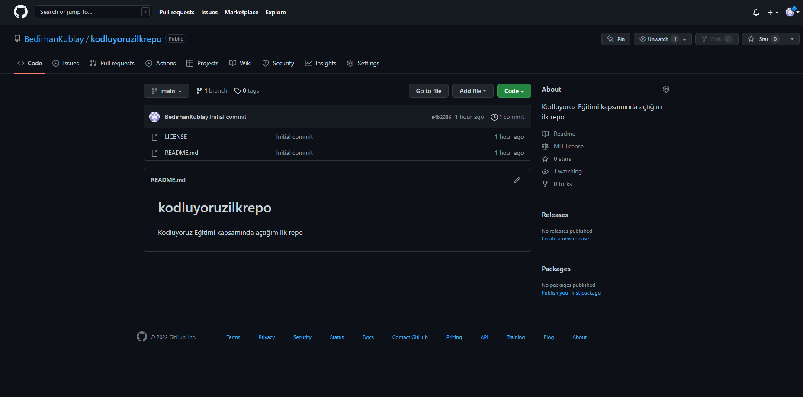

**# Kodluyoruz İlk Repo**

[Kodluyoruz](http:://www.kodluyoruz.org) Eğitimi kapsamında açtığım ilk repo. İçerisinde bir adet README dosyası, bir adet de index.html barındırıyor.

## Installation

git clone https://github.com/BedirhanKublay/kodluyoruzilkrepo.git

## Usage

Projeyi cloneladıktan sonra Visual Studio Code programında açınız.

Linux için

cd kodluyoruzilkrepo

code . 

## Contributing

Pull requestler kabul edilir. Büyük değişiklikler için, lütfen önce neyi değiştirmek istediğinizi tartışmak için bir konu açınız.

## License

[MIT](https://choosealicense.com/licenses/mit/)

